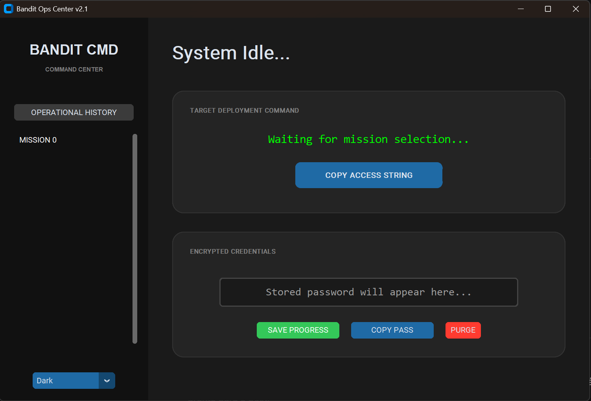
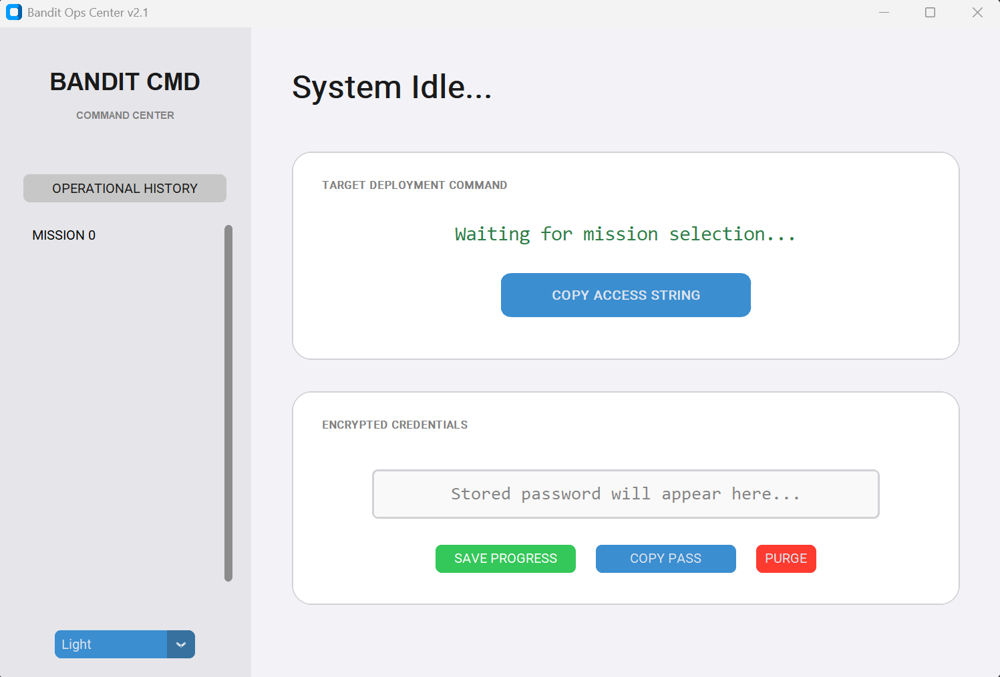

# 🛡️ Bandit Ops Center V1.0
**An intuitive mission manager and credential vault for OverTheWire's Bandit wargame.**

Built with **Python** and **Object-Oriented Programming (OOP)**, this tool automates SSH command generation and securely stores credentials found during your journey in OverTheWire.

## 🚀 Key Features
- **Automated SSH Generation:** Instantly creates the command for the current level.
- **Secure Vault:** Local SQLite database to store passwords found.
- **Modern UI:** Responsive Dark/Light mode built with CustomTkinter.
- **Productivity:** One-click copy for both commands and passwords to speed up your workflow.

## 🛠️ Tech Stack
- **Language:** Python 3.12+
- **GUI:** CustomTkinter
- **Database:** SQLite3
- **Tools:** Pyperclip for clipboard management.

## 📦 Installation & Usage
1. Clone the repo: `git clone https://github.com/MSoares28/Bandit-Ops-Center.git`
2. Install dependencies: `pip install customtkinter pyperclip`
3. Run: `python main.py`

## 📸 Screenshots

### Dark Mode (Terminal Aesthetic)

### Light Mode (Enterprise Clean)

